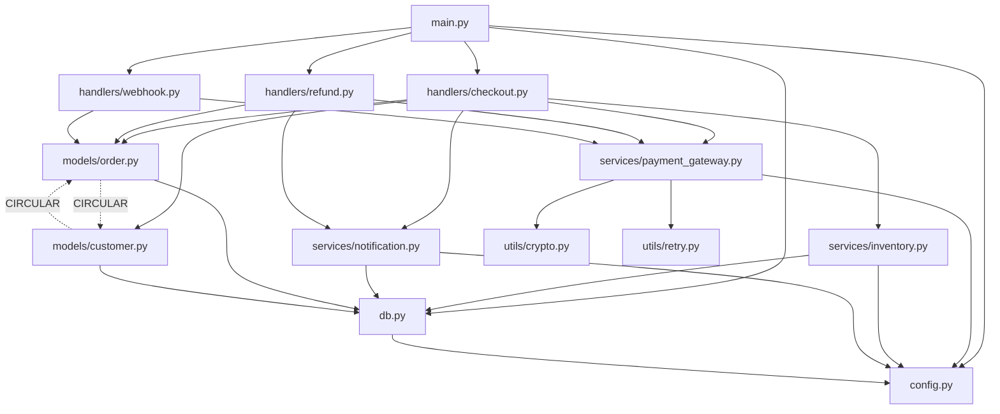

# Bootstrapping Claude Code on an Undocumented Legacy Codebase

## Overview

You've inherited a legacy Python codebase. There are no tests, no architecture docs, and the original authors left years ago. The code processes payment transactions for an e-commerce platform, and you've been tasked with adding observability instrumentation without breaking anything.

This walkthrough demonstrates how to systematically use Claude Code to:
1. Build a comprehensive `CLAUDE.md` context file by analyzing the codebase
2. Map module dependencies and identify critical paths
3. Document implicit contracts and side effects
4. Safely add OpenTelemetry instrumentation using the accumulated context

The key insight: Claude Code becomes dramatically more effective when you iteratively build context rather than expecting it to understand everything at once. We'll treat `CLAUDE.md` as a living document that grows with each analysis pass.

## Prerequisites

**Environment:**
- Claude Code CLI installed and authenticated
- Python 3.9+ with `venv`
- Git (the legacy repo should be version-controlled, even if poorly)

**Knowledge assumed:**
- Familiarity with Python module structure
- Basic understanding of distributed tracing concepts
- Comfort reading code you didn't write

**The legacy codebase structure** (what we're working with):
```
acme-payments/
├── main.py
├── config.py
├── db.py
├── handlers/
│   ├── __init__.py
│   ├── checkout.py
│   ├── refund.py
│   └── webhook.py
├── services/
│   ├── __init__.py
│   ├── payment_gateway.py
│   ├── inventory.py
│   └── notification.py
├── models/
│   ├── __init__.py
│   ├── order.py
│   └── customer.py
└── utils/
    ├── __init__.py
    ├── crypto.py
    └── retry.py
```

No `requirements.txt` exists. Imports are scattered. Some modules import from each other circularly.

## Implementation

### Step 1: Initialize CLAUDE.md with Repository Archaeology

Before asking Claude Code to understand the code, we need to give it historical context. Start by creating a minimal `CLAUDE.md` that captures what we *do* know.

Create `CLAUDE.md` in the repository root:

```markdown
# CLAUDE.md - Acme Payments Service

## Project Context

This is a legacy payment processing service for the Acme e-commerce platform.
- **Original development**: 2019-2021, team no longer at company
- **Python version**: Unknown, likely 3.7+ based on f-string usage
- **Framework**: Appears to be Flask-based (need to confirm)
- **Database**: PostgreSQL (connection strings reference 'pg' in env vars)

## Current Understanding

> This section will be expanded as we analyze the codebase.

### Known Entry Points
- `main.py` - Application bootstrap (unconfirmed)

### Critical Business Flows
- Payment checkout (revenue-critical)
- Refund processing (compliance-critical)
- Webhook handling (integration-critical)

## Analysis TODO
- [ ] Map all module dependencies
- [ ] Identify database models and their relationships
- [ ] Document external service integrations
- [ ] Find error handling patterns (or lack thereof)
- [ ] Locate any existing logging/metrics

## Constraints
- **No breaking changes**: This processes live transactions
- **No test suite**: Manual verification required
- **Limited staging environment**: Changes go to prod within days

## Commands
```bash
# Start the service (discovered command)
python main.py

# Database migrations (if any exist)
# TODO: Document migration approach
```
```

Now invoke Claude Code to perform initial reconnaissance:

```bash
claude "Analyze this legacy codebase and help me understand its structure. 
Start by:
1. Reading main.py to understand the application bootstrap
2. Identifying all Python files and their apparent purposes
3. Finding requirements/dependencies (check imports, setup.py, any .txt files)
4. Documenting your findings in CLAUDE.md under 'Current Understanding'

Be specific about what you find vs. what you're inferring."
```

Claude Code will read files, identify patterns, and update `CLAUDE.md`. After this completes, review the changes. The file might now include:

```markdown
## Current Understanding

### Application Bootstrap
`main.py` initializes a Flask application with the following sequence:
1. Loads config from environment via `config.py`
2. Initializes database connection pool (`db.py:init_pool()`)
3. Registers blueprints from `handlers/`
4. Starts background worker threads for async notifications

### Discovered Dependencies
Extracted from import statements across all modules:
- flask==1.1.x (inferred from `flask.Blueprint` usage pattern)
- psycopg2 (direct PostgreSQL driver, not SQLAlchemy)
- requests (external API calls)
- cryptography (payment data encryption)
- redis (session storage and job queue, found in `services/notification.py`)

### Module Purposes
| Module | Apparent Purpose | Confidence |
|--------|------------------|------------|
| `handlers/checkout.py` | HTTP endpoints for cart→order flow | High |
| `handlers/refund.py` | Refund request processing | High |
| `handlers/webhook.py` | Stripe/PayPal callback handlers | Medium |
| `services/payment_gateway.py` | Abstracts Stripe + PayPal APIs | High |
| `services/inventory.py` | Stock reservation and release | Medium |
| `services/notification.py` | Email/SMS via background jobs | High |
| `models/order.py` | Order data class + DB queries | High |
| `models/customer.py` | Customer data class + DB queries | Medium |
| `utils/crypto.py` | AES encryption for card tokens | High |
| `utils/retry.py` | Retry decorator with backoff | High |
| `db.py` | Connection pooling, raw SQL execution | High |
| `config.py` | Environment variable loading | High |
```

### Step 2: Deep-Dive Dependency Mapping

Surface-level understanding isn't enough for safe instrumentation. We need to know which modules call which, especially for the critical payment path.

```bash
claude "Create a dependency map for this codebase. For each Python module:
1. List what it imports from other modules in this repo
2. List what external libraries it uses
3. Identify any circular dependencies
4. Note which modules have side effects on import (global state, DB connections, etc.)

Format this as a Mermaid diagram in CLAUDE.md, plus a detailed table.
Flag any concerns about the dependency structure."
```

After this analysis, `CLAUDE.md` gains a dependency section:

```markdown
## Dependency Map

### Module Graph


### Circular Dependency Warning
**`models/order.py` ↔ `models/customer.py`**: These modules import each other.
- `order.py` imports `Customer` to attach customer data to orders
- `customer.py` imports `Order` to provide `customer.get_orders()` method
- Currently works due to Python's import caching, but fragile

### Import Side Effects
| Module | Side Effect on Import | Risk |
|--------|----------------------|------|
| `config.py` | Reads all env vars, raises if missing | Medium - fails fast |
| `db.py` | **Creates connection pool** | High - import order matters |
| `services/notification.py` | Spawns Redis connection | Medium - silent failure possible |
```

### Step 3: Document Implicit Contracts

Legacy code is full of undocumented assumptions. We need Claude Code to find them.

```bash
claude "Analyze the checkout flow end-to-end (handlers/checkout.py → all called modules).
Document:
1. Expected request format and all validation performed
2. Database transactions - are they used? What's the isolation level?
3. External API calls - timeout settings, retry behavior, error handling
4. State mutations - what changes and in what order?
5. Failure modes - what happens if each step fails?

Update CLAUDE.md with a 'Checkout Flow Contract' section.
Be explicit about what's implicit - things that aren't in the code but are assumed."
```

Claude Code produces detailed analysis:

```markdown
## Critical Flow: Checkout

### Request Contract
Endpoint: `POST /api/v1/checkout`
```python
# Expected payload (reconstructed from validation in checkout.py:48-67)
{
    "cart_id": str,          # UUID, validated
    "customer_id": str,      # UUID, validated  
    "payment_method": str,   # "stripe" | "paypal", validated
    "payment_token": str,    # From client-side tokenization, NOT validated for format
    "shipping_address_id": str  # UUID, optional (uses default if missing)
}
```

### Transaction Boundaries
**WARNING: No database transactions are used.**
- `order.create()` performs INSERT then separate UPDATE for status
- `inventory.reserve()` uses separate connection, no coordination
- Failure after order creation but before inventory reservation leaves orphan orders

### External API Behavior
| Service | Timeout | Retries | On Failure |
|---------|---------|---------|------------|
| Stripe | 30s (hardcoded) | 3 via `@retry` | Returns error dict, doesn't raise |
| PayPal | 30s (hardcoded) | 3 via `@retry` | **Raises exception** |
| Inventory internal | None | None | Raises `InventoryError` |

### State Mutation Sequence
```
1. Validate request (no state change)
2. Load customer from DB (read)
3. Load cart items from DB (read)  
4. Calculate totals (no DB)
5. Create order record (INSERT - point of no return for order)
6. Reserve inventory for each item (separate INSERTs)
7. Charge payment gateway (external API)
8. Update order status to 'paid' (UPDATE)
9. Queue notification job (Redis LPUSH)
10. Clear cart (DELETE)
```

### Implicit Assumptions
1. **Cart items haven't changed price** - Prices are re-fetched but not compared to cart snapshot
2. **Customer exists and is active** - No status check, just existence check
3. **Single currency** - All prices assumed USD, no currency field in orders
4. **Idempotency** - None. Double-submit creates duplicate orders.
5. **Inventory accuracy** - No lock; race condition possible between reserve check and actual reserve
```

### Step 4: Identify Instrumentation Points

Now that we understand the system, we can plan instrumentation. We want Claude Code to help us identify *where* to add tracing without changing behavior.

```bash
claude "Based on the CLAUDE.md context, identify all instrumentation points for 
OpenTelemetry distributed tracing in the checkout and refund flows.

For each point, specify:
1. File and function/method
2. What span to create (name, attributes)
3. What to capture (timing, success/failure, relevant IDs)
4. Risk level of adding instrumentation there (low/medium/high)
5. Any existing patterns we should match (logging, error handling)

Add this as an 'Instrumentation Plan' section in CLAUDE.md.
Prioritize observability value vs. implementation risk."
```

This produces our instrumentation roadmap:

```markdown
## Instrumentation Plan

### Priority 1: Entry Points (Low Risk)
These wrap entire request handlers - minimal code intrusion.

| Location | Span Name | Attributes | Risk |
|----------|-----------|------------|------|
| `handlers/checkout.py:process_checkout()` | `checkout.process` | `customer_id`, `cart_id`, `payment_method` | Low |
| `handlers/refund.py:process_refund()` | `refund.process` | `order_id`, `refund_amount`, `reason` | Low |
| `handlers/webhook.py:handle_stripe_webhook()` | `webhook.stripe` | `event_type`, `event_id` | Low |

### Priority 2: External Calls (Medium Risk)
Wrapping outbound API calls. Must preserve existing retry/error behavior.

| Location | Span Name | Attributes | Risk |
|----------|-----------|------------|------|
| `services/payment_gateway.py:charge_stripe()` | `payment.stripe.charge` | `amount`, `currency`, `idempotency_key` | Medium |
| `services/payment_gateway.py:charge_paypal()` | `payment.paypal.charge` | `amount`, `currency` | Medium |
| `services/notification.py:queue_email()` | `notification.queue` | `notification_type`, `recipient_id` | Low |

### Priority 3: Database Operations (Medium Risk)
`db.py` is the chokepoint - instrumenting here covers all queries.

| Location | Span Name | Attributes | Risk |
|----------|-----------|------------|------|
| `db.py:execute()` | `db.query` | `operation` (SELECT/INSERT/etc), `table` (parsed from SQL) | Medium |
| `db.py:execute_many()` | `db.query.batch` | `operation`, `table`, `count`